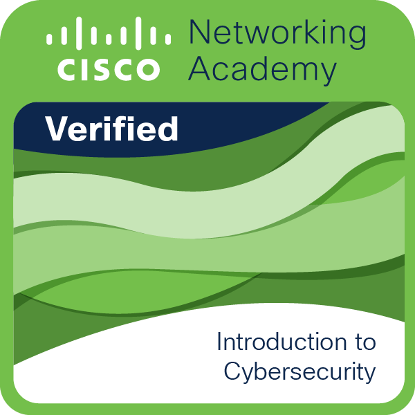

# **Dev-Nin**
***

- 🔭 I’m currently working on finishing my studies
- 🌱 I’m currently learning Python, JavaScript, Pixelart, Networking
- 👯 I’m looking to collaborate on any project to develop furthermore my knowledge
- 🤔 I’m looking for help with Pixelart Basics
- 💬 Ask me about Python
- 📫 How to reach me: cesar-nin@hotmail.com
- 😄 Pronouns: Me, Nin
- ⚡ Fun fact: I knew nothing about programming when I started University
## Hobbies
* Videogames:
  * Used to play LoL, but I left 6 months ago
  * Valorant sometimes
  * Mostly singleplayer RPGs
  * Nintendo in my veins since I was a kid
  * Played every Zelda up to Skyward Sword
* Series
  * The Office
  * Parks and Recreations
  * Prison Break
  * Brooklyn 99
* Movies
  * Action
  * Comedy
  * Mystery
  * Slash Horror
  * Animation 
## Skills
* Coding
  * Python (Beginner-Intermediate)
  * Javascript (Beginner)
  * Planning to learn a C language
* Networking (Cisco Courses)
  * Routing and Switching Essentials
  * Scaling Networks
  * Network Programmability
  * Bridging
* Artistic
  * None lol
  * I'm really trying to learn Pixelart though
* Other
  * NDG Linux Essentials
  * Cybersecurity
***

